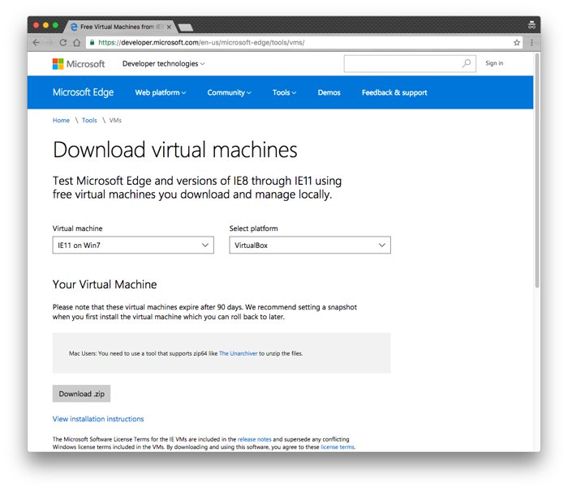
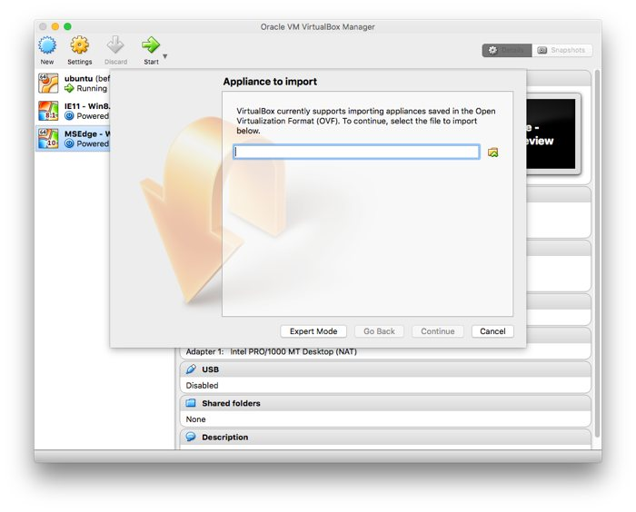

In this tutorial we're going to set up an environment to be able to test our
React UI on different versions of Internet Explorer.  Which versions you use is
completely up to you and/or your companies needs.

::: info
This tutorial assumes you're on a Mac.  If you're not, feel free to follow along,
most content will still apply.
:::

Before getting started make sure you have VirtualBox installed on your machine.
If you don't have VirtualBox installed [you can find their downloads page
here](https://www.virtualbox.org/wiki/Downloads).  At the time of writing, the
latest version is `5.1` (which I'll be using).

## tl;dr

1.  Install VirtualBox [from here](https://www.virtualbox.org/wiki/Downloads)
2.  Download I.E. versions [from here](https://developer.microsoft.com/en-us/microsoft-edge/tools/vms/)
3.  Unzip the VMs and import them into VirtualBox
4.  Start up the VM and start clicking on buttons :smile:

## Getting Images
Now that VirtualBox is installed the next step is to download all the different
versions of IE we want to test.

For the project I'm currently working on I want to support IE11 and the latest
version of Edge.  Microsoft is nice enough to provide images for IE 8-11 and the
Stable and Preview versions of Edge.  [You can find those image downloads
here](https://developer.microsoft.com/en-us/microsoft-edge/tools/vms/).  

::: warning
It's important to select the 'VirtualBox' platform when downloading your images.
:::



Browse through the different versions and download all the `.zip`'s that you'll
need.  These files tend to be ~ 5gb so it can take a while to download.  Perfect
time to take a beer break :beers:.

## Unzipping IE Versions

On the Microsoft downloads page it recommends installing [The Unarchiver](http://unarchiver.c3.cx/unarchiver) to unzip the files.  Go ahead and grab that from the App store if you don't already have it.

::: info
Newer versions of Mac can probably use the built in `Archive Utility.app` but
for the sake of avoiding issues you can just download and use Unarchiver.
:::

This process can take quite a bit of time as well.  Once it's complete you
should have some `*.ova` files.  For example, when downloading IE11 for Windows
8 the Unarchiver produced a `IE11 - Win8.1.ova` file.

## Import `.ova`'s Into VirtualBox
Head over to VirtualBox and go to File > Import Appliance or hit `command + i`.
You should see a screen like this:



Hit the little folder with the green arrow and find your `.ova` file and hit
'continue'.  Normally when I set up a VM I like to beef it up a bit with
multiple cores and additional RAM but since these VM's are very minimal, and just
to test the app in different browsers, feel free to stick with the recommended
settings.

## Test your React Application

Boot up your React application and find what IP address your machine is on.  To
do that you can head to the command line and type `ifconfig`.

You should see some output that looks similar to this:
```sh
en0: flags=8863<UP,BROADCAST,SMART,RUNNING,SIMPLEX,MULTICAST> mtu 1500
	ether 80:e6:50:0c:d4:08
	inet6 fe80::82e6:50ff:fe0c:d408%en0 prefixlen 64 scopeid 0x4
	inet 10.0.1.43 netmask 0xffffff00 broadcast 10.0.1.255
	nd6 options=1<PERFORMNUD>
	media: autoselect
	status: active
```

Find the line that says: `inet 10.0.1.43` (**NOTE**: this will be a different number for
you).

Start up your VM inside VirtualBox, open IE, and type: `http://<YOUR IP
HERE>:<YOUR PORT HERE>` and start clicking away!

On my machine that URI would have looked like: `http://10.0.1.43:3000`.


