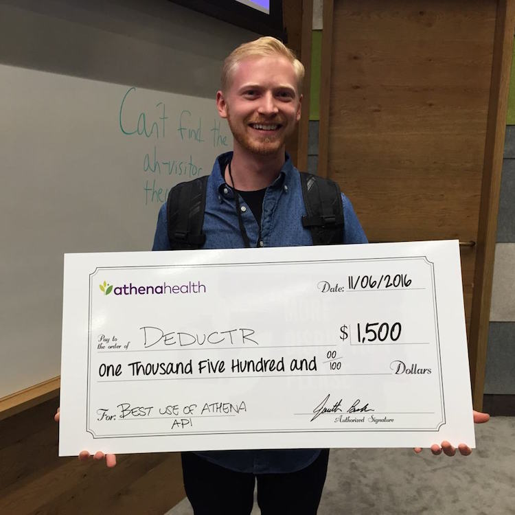
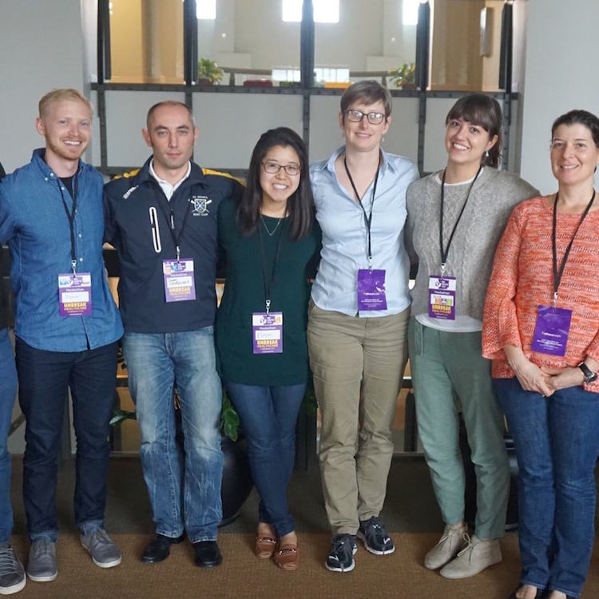

A few weeks ago, after much trepidation, I decided to attend the athenahealth MDP
hackathon.  This was the first official hackathon with potential prizes that
I've ever entered.  I'm not entirely sure why I hadn't entered any competitions
prior to this event. It's funny because when I was in sales and management
competition drove most of my results.  Something about software development brews
emotions of imposter syndrome and a _constant feeling of not being good enough_.
Maybe you can relate?

I've always admired developers who are **truly** full stack.  I bet you know the
type.  The people who can architect a clean backend, design a beautiful
UI, include a feature complete CLI, and also somehow manage to craft an incredible user experience.  The unicorns.
The fully monty.  People like [T.J. Holowaychuk](https://github.com/tj) and [Guillermo Rauch](https://github.com/rauchg).

Prior to the hackathon I had been working really hard trying to develop an "eye
for design" (whatever that means).  Becoming a better designer is probably one
of the hardest, most frustrating things I've ever tried to do.  

I spent a lot of time watching [Sketch.app](https://www.sketchapp.com/) videos and making various mock
ups to level up my skills.  There is this quote by Katrina Owen that I
absolutely love and try to remind myself of when learning a new technology or skill:

> Skill develops when we produce, not when we consume - Katrina Owen

Watching endless amounts of videos would never make me a better designer.

I decided that the hackathon would be the perfect opportunity to put my skills
to the test.  **To produce under pressure**.  To see if after ~2-3 years of ridiculously hard work people would
like the things I can create.

### The App

We recorded a short video demonstrating the application:
@[vimeo](190456167)

I'm sure you noticed how similar it looks to my blog :).  I ended up loving the
design of Deductr so much that I re-purposed it for my blog.

### So... What Did It Do?

Deductr was a simple application that allows patients to see how far away they
are from reaching their insurance deductibles.  It takes advantage of the
athenahealth API to parse insurance claims and displays that data in an easy to
understand interface.

If the patient is on a family plan they can toggle between how close the whole
family is to reaching the deductible versus their individual amount.

The business plan involved offering patients easy to set up payment plans for
whatever amount they still owe.  To do that I just set up a temporary test
Stripe account.

### What Did I Learn?
* **Keep your hackathon teams small and lean.**  We had an enormous team and
  that made it really hard to make decisions on the direction to take.  Too many
  cooks in the kitchen.
* **Business value is equally as important as the technical artifact**. Going into the
    competition I thought the best built app would win.  That was 100% not the
    case.  Technically speaking, Deductr was incredibly simple and easy to
    create.  The reason we placed was due to the amount of time spent thinking
    of business pains we could solve/make easier.
* **You will have some sort of technical issue, be prepared to push through
    it.**  We thought we were smart for recording a screencast of our app and
    doing the presentation with the pre-recorded video.  Of course, the video
    messed up in the middle of the presentation :expressionless:.  Luckily, our team lead did
    an amazing job continuing the pitch in spite of this unexpected dilemma.
*  **Have fun!** Regardless of whether or not your team wins or loses hackathons
    are a great opportunity to hack on some cool ideas and meet interesting
    people.  Don't take it too seriously.

