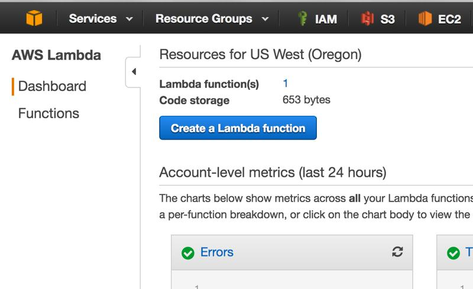
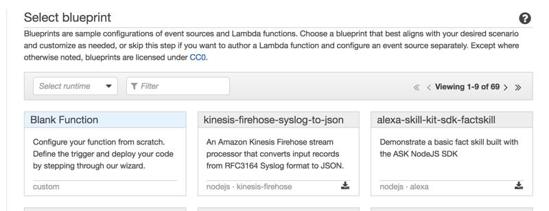
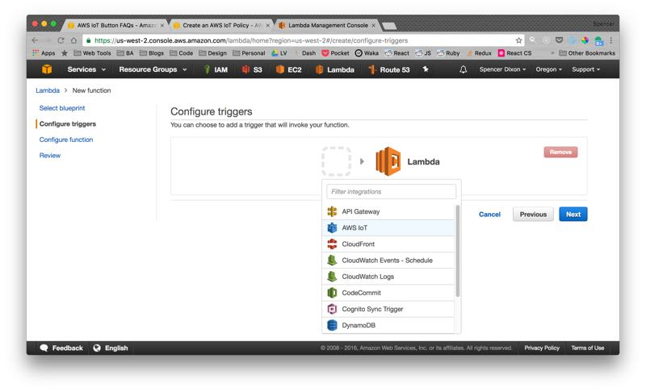
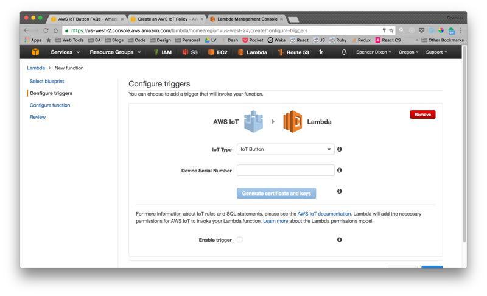

For the last couple weeks my roommate [Sam Shames](https://positivepeerpressure.blog/) and I have been holding each other
accountable to waking up at 6:00am. 

I want to start getting more insight into my sleep schedule and I love tracking
data about myself,  so this was the perfect opportunity to play around with an AWS IoT button my
coworker had just given to me.  One click could log a wake up time and two
clicks could log a bed time.  I just keep the button right on my bedside table
and boom: fool proof sleep tracking.

Obviously this won't track the exact time I fell asleep but I'm more concerned
with identifying patterns of when I enter my room to go to bed and how those
times affect my wake up times.

::: info
_One thing to note is I already have a personal "Life API" called [Roots](https://dashboard.spencerdixon.com/login) (**username:** demo@example.com **password:** password if you want to check it out) I use to track other areas of my life.  All I needed to do was add a few endpoints that could log my wake up/bed times._
:::

### Setup
It was surprisingly simple to set everything up.  Create an AWS Lambda Function,
make my IoT Button the trigger, and have the Lambda Func hit my personal Life
API.

First step is creating an AWS account if you don't already have one.  Then head
over to the Lambda Service and hit the `Create a Lambda Function` button.



I then choose to use a `Blank Function` since I knew that I wouldn't be
interacting with other AWS services and instead would be writing some custom
code to hit my own API.



Next you need to configure what will trigger the function being called.  AWS
makes this extremely easy by allowing you to add an IoT button directly.  



To set up the button you need to enter the serial number (found on the back of
the button) and click on `Generate certificate and keys`.  The directions are
very self explanatory, just follow along and configure your button to be able to
use your local WiFi.



The last step is to set up the code that gets called when our button gets
triggered.  I decided to just inline my function using the Node.js runtime since
it was the fastest/easiest way to get it working.

Below is the code I used for my Lambda Function.  
::: tip
**Note** how I used the `event.clickType` to determine if the request should be
a wake up click or a bed time click.
:::
```
'use strict';

exports.handler = (event, context, callback) => {
    console.log('Received event:', event.clickType);
    const http = require('http');
    let path;
    
    if (event.clickType === "SINGLE") {
        path = "/wake_up_times"
    } else if (event.clickType === "DOUBLE") {
        path = "/bed_times"
    } else {
        path = "/ping"
    }

    const options = {
      host: 'api.spencerdixon.com',
      method: 'POST',
      path: path,
      headers: {
        'Content-Type': 'application/json',
        'Authorization': process.env['ROOTS_API_KEY'],
        'Accept': 'application/vnd.life-api.com; version=1',
      },
    };
    
    const request = http.request(options, function(response) {
      console.log("CODE: ", response.statusCode);
      console.log("HEADERS: ", JSON.stringify(response.headers));
      response.on('data', (chunk) => {
        console.log(`BODY: ${chunk}`);
      });
      response.on('end', () => {
        console.log('No more data in response.')
      })
    });
    
    request.on('error', e => {
      console.log(`problem with request: ${e.message}`);
    });
    request.end()
};
```

And there you have it!  How to set up an IoT button to make a request to some
sort of API of your choosing.  I'm excited to start using the button in the
following weeks and see if I can identify any interesting patterns in my sleep
schedule.

Next step is to make some additions to my Roots React UI so I can see the
information in a nicely formatted table/D3 charts.

Cheers :beers:
