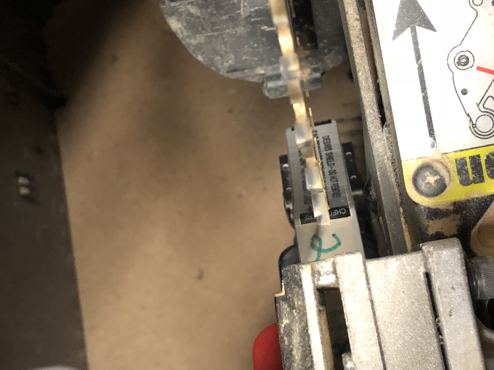
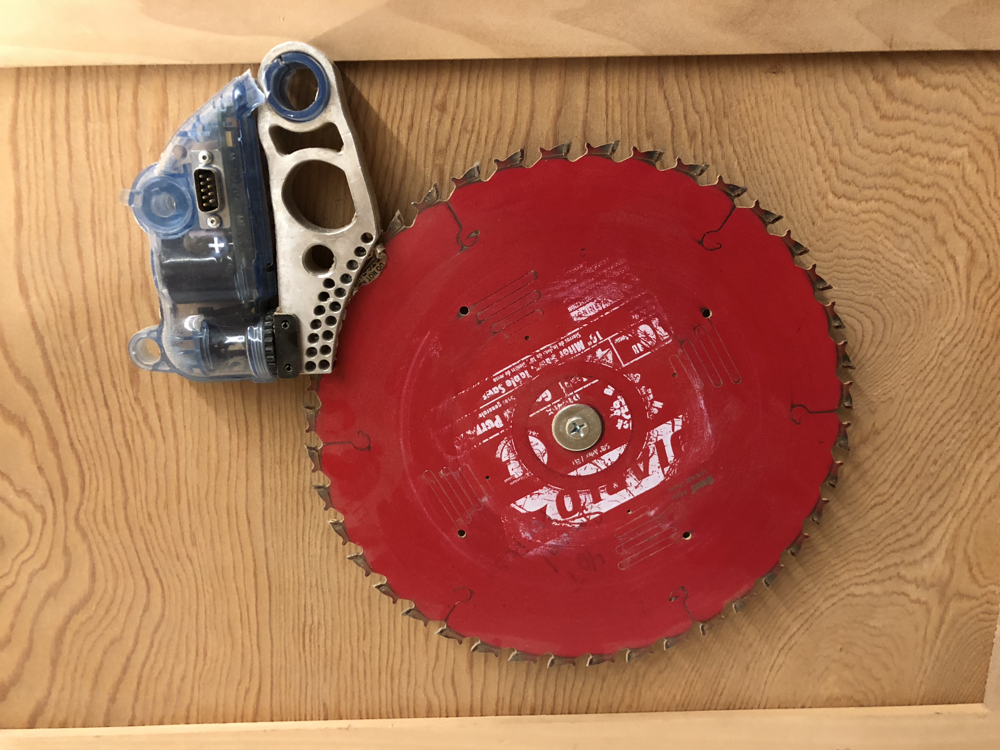
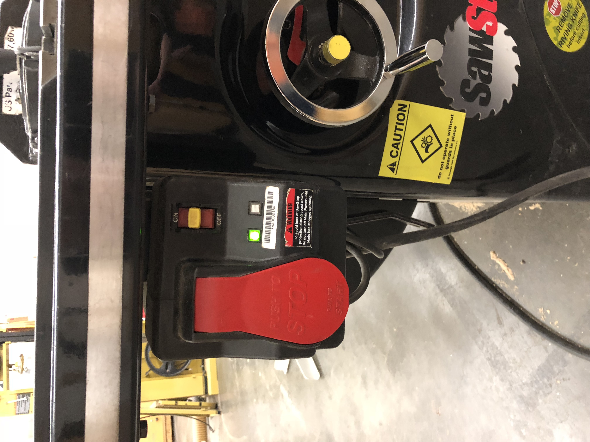
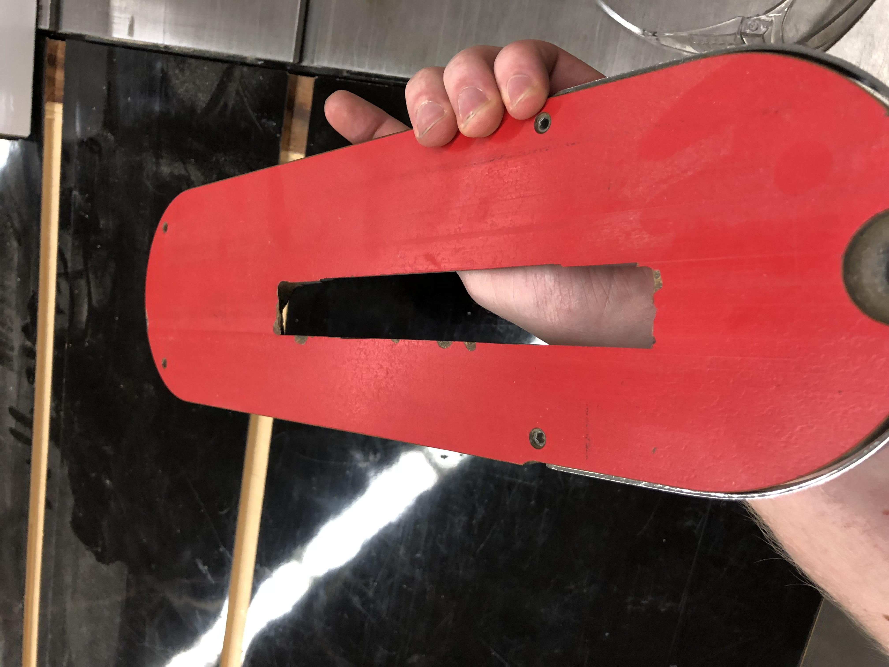
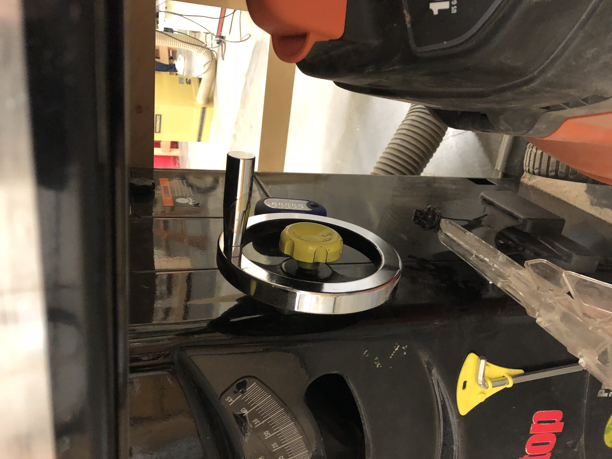
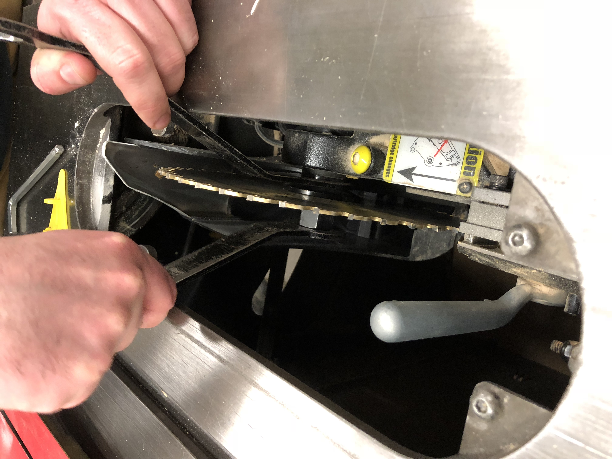
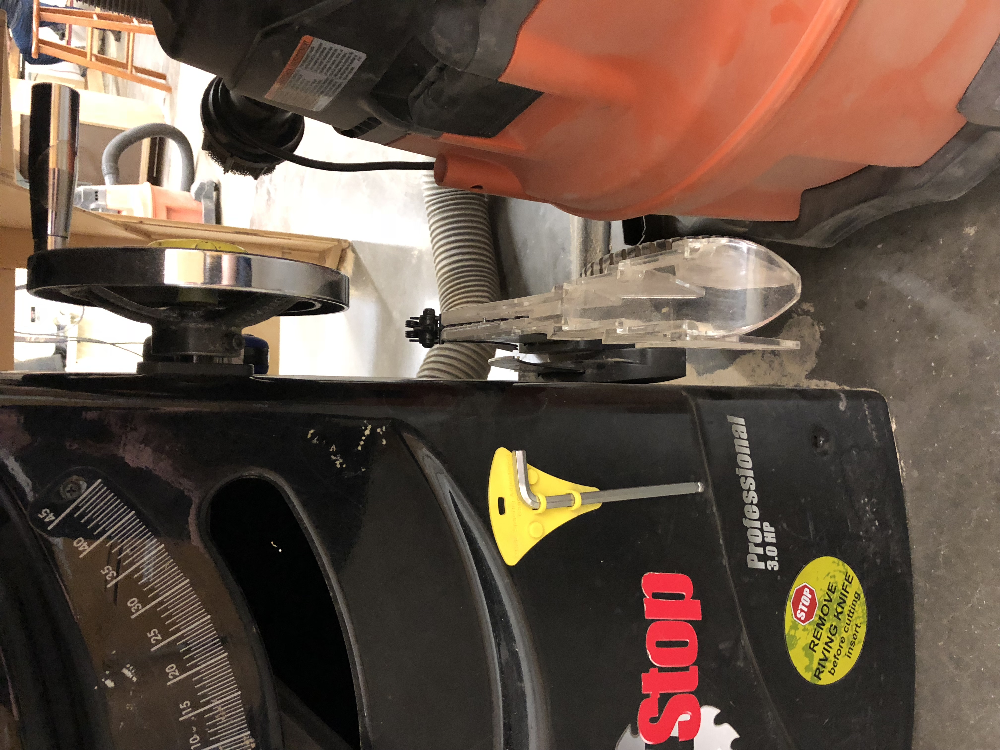

* Intro
* SawStop
* Safety tips
* Cutting
* Replacing blade

I recently took a table saw safety course at a local makers space called Artists
Asylum.  

## Safety 

Since Saw Stop blades prevent hand injuries with the "break" the primary thing to
be aware of when cutting is to never stand behind the wood you're cutting.  Kick
back can send pieces of wood flying at fast enough speeds to seriously injure
yourself.  At the shop there was a door with a two inch hole from kick back.
Our instructor also told us a story where one of his friends got a piece of wood
kicked back to his stomach and it ended up destroying his pancreas and he had to
get surgery.

## On/Off

There are two switches to the unit.  First is a global on/off switch that cuts
power to the saw.  So even if it is plugged in there is no way the blade will
start moving.  This should always be switched off when
replacing a blade or putting your hands near it.

The second switch is the big red one which starts the blade spinning and is easy
to push off with a knee/hand to stop.

TODO: Better photo with highlights

When doing larger maintence on the machine our instructor recommended completely
unplugging the system just as an added level of protection.  

The larger SawStop unit has a third switch that lets you attach a padlock so
users cannot turn the unit on even if the switch is "on" and the red switch is
pulled forward.  This can be especially useful for more public facing saws.

## Cutting

Table saws excel at extremely precise long straight cuts.  Often if you just
need a rough cut a Miter saw will be a faster and safer tool to use.

### Adjusting

There are two wheels on the saw.  One for adjusting the height of the blade and
another for spinning the angle of the cut.  Whenever adjusting the angle of the
blade you are making what is known as a bevel cut.  Alternatively, if you push a
piece of wood into the saw at an angle that is known as a miter cut.

Kinds of cuts:

* Miter
* Bevel
* Rip

## Replacing Blades

Whenever interacting with the blade **it is extremely important** to put the
saw's switch to "off" preventing power flow.  That way even if you accidently turned
it on you will be safe.

There are a few reasons one might want to replace the blade:

* Sharpen the blade
* Replace with a different size blade
* Replace with a different type of blade (Dado for example)
* Replace the break in the unit
* Clean the sawdust from the unit

Attached on the side of the saw are two wrenches that you can use to replace the
blade.  You use the left wrench to hold the axle in place and the right to
loosen the nut.  Once it's loose you can unscrew with your hand **making sure to
not drop the nut**.  It can be extremely difficult to get the nut out if dropped
so that is the most important step to be aware of.

Once the nut is off the blade slides right off and a new one can be placed on.
There is a handy little yellow gauge with a wrench for adjusting the brake once
you put the new blade on.  The yellow gauge has two levels a thin lower level
about the thickness of a credit card then a second level about two credit cards
in thickness.  The blades should be a credit card distance from the brake as
seen below:

